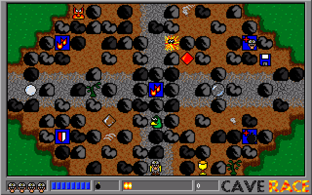
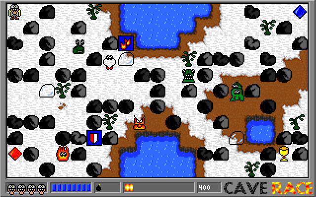
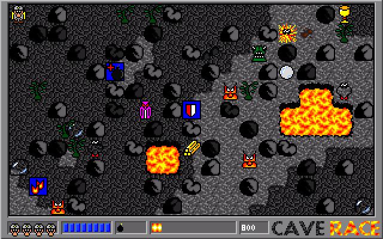
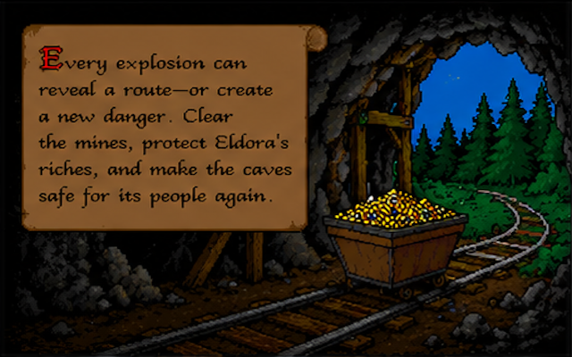
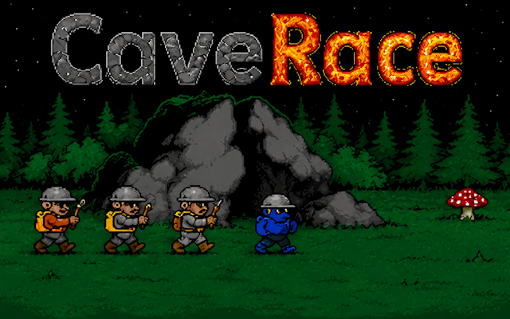

# CaveRace

CaveRace is a maze-action game created in 1997 by Clemens Schotte and the
original CaveRace team. Inspired by *[Dyna Blaster]* (*Bomberman*), it sends a
miner into the caves of Eldora to collect treasure, open passages with bombs,
and defeat an alien invasion.

The repository preserves every major CaveRace codebase—from the original
MS-DOS game to the current Odin editions—together with their artwork, levels,
build files, and version-specific documentation.

| Forest | Winter | Lava |
| --- | --- | --- |
|  |  |  |

## Current editions

### CaveRace 2.1

**CaveRace 2.1 is the current edition and recommended starting point.** It
brings the 25-cave CaveRace 2 campaign from the Windows Phone era to modern Windows and
macOS through a from-scratch [Odin] and [raylib] rewrite. The installed game is
branded **CaveRace 2**.

It includes four themed worlds, an interactive tutorial, two difficulty
profiles, medal-based cave results, keyboard/mouse/controller support,
remappable controls, accessibility-oriented presentation settings, and
desktop and Store packaging.

[Read the CaveRace 2.1 guide](<2.1 Odin (Windows & MacOS)/README.md>)

### CaveRace 1.5

CaveRace 1.5 is the modern edition of the original MS-DOS ten-cave campaign. It uses
the same Odin/raylib foundation and is available for Windows and macOS for
players who want the compact, original classic CaveRace experience.

[Read the CaveRace 1.5 guide](<1.5 Odin (Windows & MacOS)/README.md>)

Downloads, screenshots, and more background are available on the
[official CaveRace website](https://caverace.com/).

| Story | Main menu | Controls |
| --- | --- | --- |
|  |  |  |

## How to play

Clear a cave by destroying every alien. Along the way, collect gold, diamonds,
and useful items hidden among the rocks.

Bombs are both tool and hazard. Their blasts break soft stone and defeat
enemies, but can also destroy treasure, remove power-ups, and injure the
player. Dense rock cannot be moved, so success depends on planning a route,
placing a bomb, and reaching safety before it explodes.

The current desktop editions are fully offline and contain no accounts,
advertising, in-app purchases, analytics, or online services.

## The story of Eldora

Far out in space lies Eldora, a small planet whose people have built their
lives around treasure-filled mines. Each day, miners venture underground to
recover gold, diamonds, and other precious minerals.

Then aliens invade the caves, threatening Eldora's people and the riches they
depend on. The miners' only practical defense is the same explosive equipment
they use to open passages through rock.

You are one of those miners. Enter the infested caves, recover their treasure,
and make Eldora's mines safe again.

## Version history

Each preserved version has its own guide with the relevant toolchain, build
instructions, controls, source layout, and compatibility notes.

| Version | Year | Platform and technology | Documentation |
| --- | ---: | --- | --- |
| 1.2 | 1997 | Original MS-DOS release; Borland C and x86 assembly | [1.2 guide](<1.2 Original (MS-DOS)/README.md>) |
| 1.3 | 2002 | Windows port; Visual C++ and DirectX 8.1 | [1.3 guide](<1.3 DirectX (Windows)/README.md>) |
| 1.4 | 2012 | Windows 8 Store app; C# and SharpDX | [1.4 guide](<1.4 SharpDX (Windows)/README.md>) |
| 2.0 | 2012 | Windows, Windows Phone, and Xbox 360; C# and XNA 4.0 | [2.0 guide](<2.0 XNA (Windows Phone & XBox)/README.md>) |
| 1.5 | 2026 | Classic ten-cave campaign; Odin and raylib for Windows/macOS | [1.5 guide](<1.5 Odin (Windows & MacOS)/README.md>) |
| **2.1** | **2026** | **25-cave CaveRace 2 campaign; Odin and raylib for Windows/macOS** | **[2.1 guide](<2.1 Odin (Windows & MacOS)/README.md>)** |

Version numbers describe two related lines: 1.5 modernizes the original
campaign, while 2.1 modernizes the expanded campaign introduced by 2.0.

## Original MS-DOS release

CaveRace 1.2 targets an Intel 80386-compatible IBM PC running MS-DOS with a
320×200, 256-color VGA display (Mode 13h). It is written mainly in C with x86
assembly routines for memory and graphics, and was built with Borland C 3.1.

Marijn Schotte created the artwork on an Amiga with [Deluxe Paint]. The source
art uses IFF (Interchange File Format); screens and 16×16 tiles were converted
to raw indexed graphics with a shared 256-color RGB palette for the DOS game.

See the [CaveRace 1.2 guide](<1.2 Original (MS-DOS)/README.md>) for historical
build instructions, file formats, launch options, and cheats.

## Credits

Original CaveRace team:

- [Clemens Schotte](https://www.linkedin.com/in/cschotte/) — code and concept
- [Marijn Schotte](https://www.linkedin.com/in/marijn-schotte-a224a2216/) — artwork and concept
- [Paul Bosselaar](https://www.linkedin.com/in/paul-bosselaar/) — documentation
- [Paul van Croonenburg](https://www.linkedin.com/in/paul-van-croonenburg-0a389843/) — documentation
- Harro Lock — code

From version 1.3 onward, CaveRace was developed by Clemens Schotte with artwork
by Marijn Schotte.

## License

NavaTron Game Studios. Copyright © 1997–2026 NavaTron B.V.

The source code is licensed under the [Apache License 2.0](LICENSE). Game
content, artwork, music, and sound effects remain copyright NavaTron B.V.

[Dyna Blaster]: https://en.wikipedia.org/wiki/Bomberman_%281990_video_game%29
[Deluxe Paint]: https://en.wikipedia.org/wiki/Deluxe_Paint
[Odin]: https://odin-lang.org/
[Odin compiler]: https://odin-lang.org/docs/install/
[raylib]: https://www.raylib.com/
